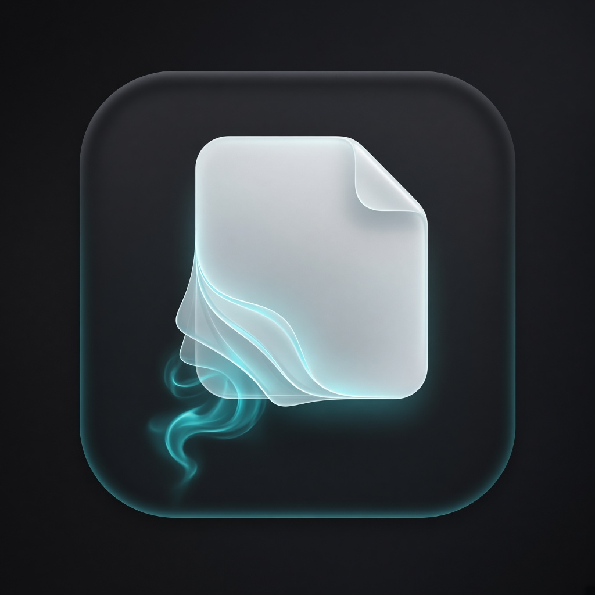
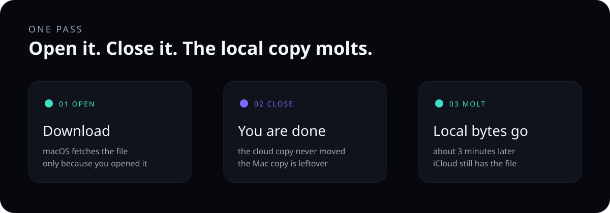

 

<h1>Molt</h1>

Local iCloud copies leave after you close the file. 
The one in the cloud stays.

  <a href="#install"><strong>Install</strong></a>
  &nbsp;·&nbsp;
  <a href="#use">Use</a>
  &nbsp;·&nbsp;
  <a href="#how">How it works</a>
  &nbsp;·&nbsp;
  <a href="#first-pass">First pass</a>

 

<table>
  <tr>
    <td width="33%" align="center"></td>
    <td width="67%">
      <h3>A file should visit. It should not move in.</h3>
      
macOS will download an iCloud Drive file when you open it, then keep the bytes around because the disk is not full. Molt drops that local copy a few minutes after you are done. Open it again later and it downloads again.

    </td>
  </tr>
</table>

 

  
   
  

<h2 id="install">Install</h2>

macOS 14 or newer. Xcode or the Swift command line tools.

<pre><code>git clone https://github.com/Lebyy/molt.git
cd molt
make install
</code></pre>

<code>make install</code> builds a release binary with warnings as errors, copies it to <code>~/Library/Application Support/molt</code>, signs that copy, and registers a login agent. It also turns on Optimize Mac Storage (<code>com.apple.bird</code> <code>optimize-storage</code>), which is the setting that downloads a file only when you open it.

The first time the agent runs, macOS may ask for iCloud Drive access. Allow it. Without that, molt can see the folder and still not release anything.

<h3>By hand</h3>

<pre><code>swift build -c release -Xswiftc -warnings-as-errors
.build/release/molt install
</code></pre>

<h3>Stop</h3>

<pre><code>.build/release/molt uninstall
</code></pre>

That unloads the agent and deletes its plist. The log file stays.

<h2 id="use">Use</h2>

<table>
  <tr><th>Command</th><th>What it does</th></tr>
  <tr><td><kbd>molt</kbd></td><td>Release local copies once, now</td></tr>
  <tr><td><kbd>molt install</kbd></td><td>Same thing at login, then every 3 minutes</td></tr>
  <tr><td><kbd>molt status</kbd></td><td>Whether the agent is loaded, plus the last log lines</td></tr>
  <tr><td><kbd>molt uninstall</kbd></td><td>Stop the agent</td></tr>
  <tr><td><kbd>molt help</kbd></td><td>The same list, in the terminal</td></tr>
</table>

A pass names only the top level of iCloud Drive, the folders you see in the sidebar. Evicting a folder tells the system to drop the local copies inside it. Walking every nested file through File Provider stalls, so molt does not do that.

A folder that is busy, or is not an iCloud item, is left in place and written to the log as <code>kept</code>.

<pre><code>tail -f ~/Library/Application\ Support/molt/molt.log
</code></pre>

<h2 id="how">How it works</h2>

<ol>
  <li>You open a file. macOS downloads it. That part is Optimize Mac Storage, not molt.</li>
  <li>You close it. The cloud file was never the thing being removed.</li>
  <li>About every 3 minutes, <code>FileManager.evictUbiquitousItem</code> drops the local bytes of each top-level iCloud Drive item.</li>
</ol>

Molt does not upload, rename, or delete anything in iCloud. It does not touch the Photos library. Desktop and Documents are included only when they already live inside iCloud Drive.

<h2 id="first-pass">First pass</h2>

  

<table>
  <tr><th></th><th>Result</th></tr>
  <tr><td>When</td><td>23 Sep 2026, on the Mac this was written on</td></tr>
  <tr><td>Released</td><td><code>Projects</code> and <code>Downloads</code></td></tr>
  <tr><td>Kept</td><td>0</td></tr>
  <tr><td>Time</td><td>11 seconds</td></tr>
  <tr><td>Files removed from iCloud</td><td>0</td></tr>
</table>

That is one machine, one pass. It is not a study and it is not a promise about how many gigabytes you get back. A folder that was already a cloud placeholder had nothing local to shed.

<h2>Layout</h2>

<pre><code>Sources/MoltCore        command parsing, the launch agent plist, the log
Sources/molt            the command line: evict, install, status
Sources/molt-selfcheck  the checks (XCTest is not in the command line tools)
assets                  renders and the diagrams above
</code></pre>

<pre><code>make test
</code></pre>

MIT. Copyright 2026 Lebyy.

